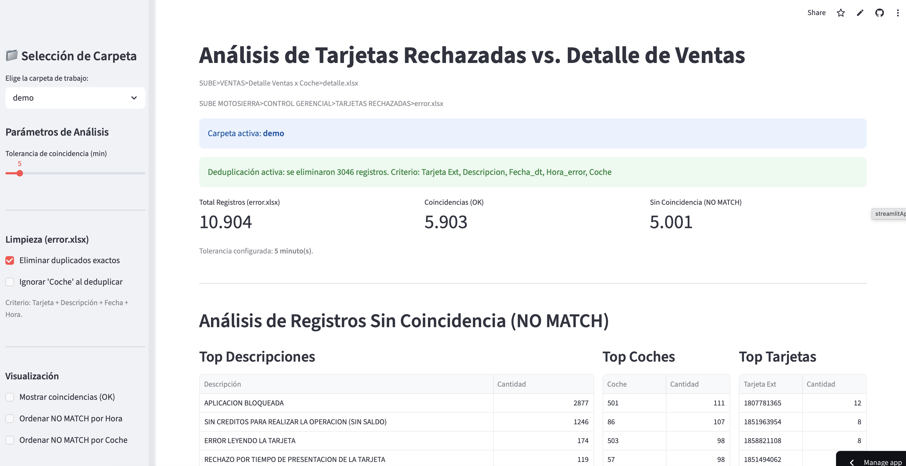
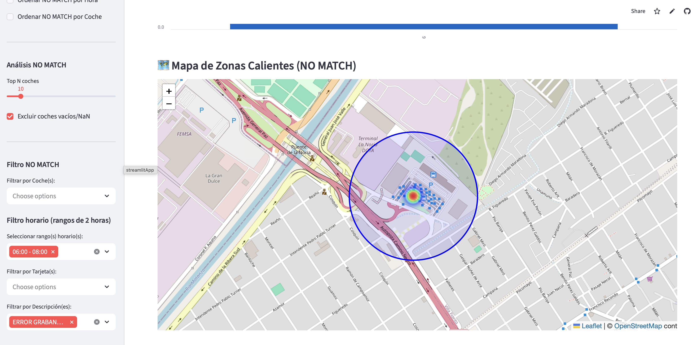
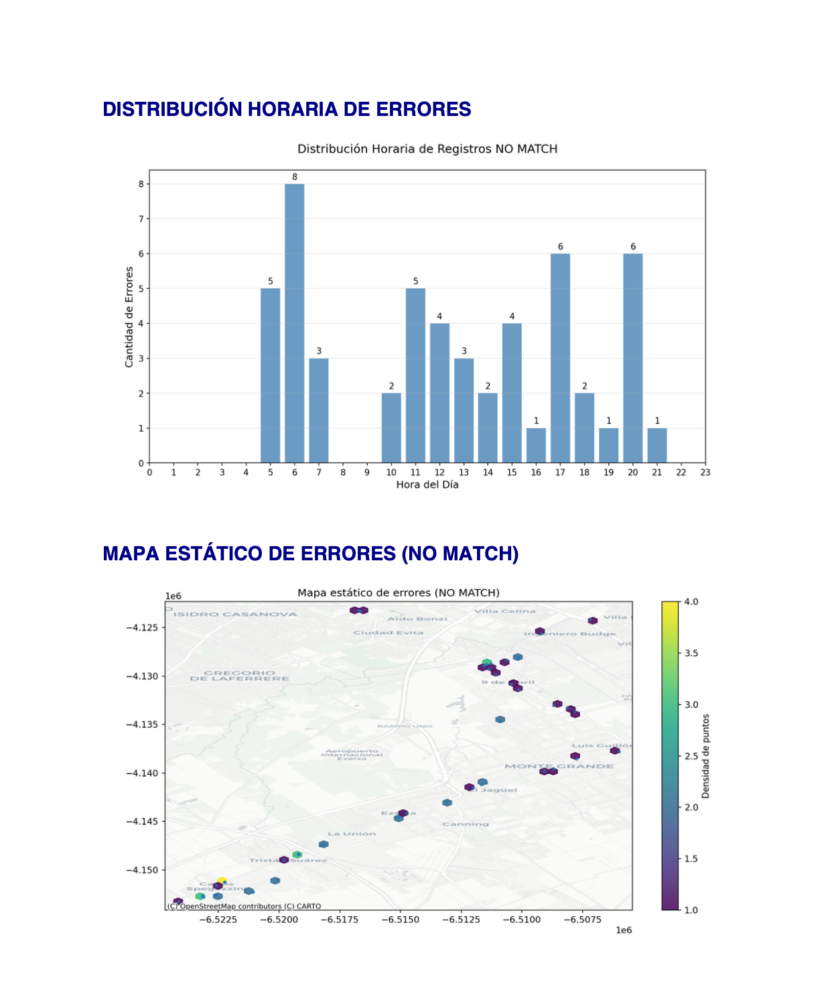

# SUBE Card Error Analysis

[](https://sube-card-error-analysis-bkpk6whvgvogjsdkam4wxn.streamlit.app/)

Streamlit web application to analyze rejected SUBE transit card transactions and compare them with ticket sales records.

SUBE cards are contactless smart cards used in Argentina by passengers to pay for public transportation such as buses, trains, and subway systems.

This application helps detect operational issues by analyzing rejected card transactions and verifying whether they correspond to actual sales.

---

## Features

- Analyze rejected SUBE card transactions
- Match errors against sales records with configurable time tolerance
- Identify vehicles with the highest number of errors
- Detect frequently failing cards
- Time distribution analysis of errors
- Geographic heatmap visualization of error locations
- Export results to Excel
- Automatic PDF report generation

---

## Technologies

- Python
- Streamlit
- Pandas
- Folium
- Matplotlib
- ReportLab

---

## Live Demo

Open the deployed app here:

https://sube-card-error-analysis-bkpk6whvgvogjsdkam4wxn.streamlit.app/

## Screenshots

### Dashboard



### Error Heatmap



### Generated PDF Report


---
## How it works

1. The application loads two Excel files:

   - **error.xlsx**: rejected SUBE card transactions recorded by the validator.
   - **detalle.xlsx**: ticket sales records.

2. The system cleans and normalizes the data.

3. Transactions are matched by card number and compared by time.

4. If a rejected transaction has a corresponding sale within a configurable time tolerance window, it is marked as:

   - **OK**

5. Otherwise it is classified as:

   - **NO MATCH**

6. The application then generates several analyses:

   - Top error descriptions
   - Vehicles with the most errors
   - Frequently failing cards
   - Hourly error distribution
   - Geographic heatmap of error locations

7. Users can export results to Excel or generate a **PDF report** automatically.

## Project Structure

```text
sube-card-error-analysis
│
├── Fechas
│   └── demo
│       ├── detalle.xlsx
│       └── error.xlsx
│
├── app.py
├── requirements.txt
├── README.md
└── .gitignore
